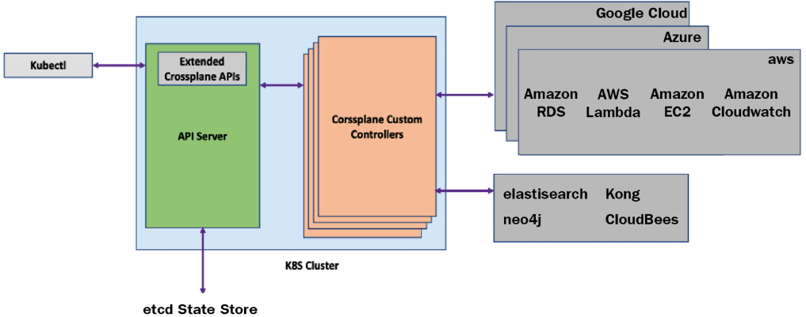

# Crossplane as a Universal Cloud Control Plane

- With Crossplane, we can assemble infrastructure from multiple could providers to expose them as a high-level API.
- These APIs can provide a universal experience across teams, irrespective of the underlying cloud vendor.
- Crossplane can cover end-to-end automation of both day 1 and day 2 concerns.
  - Day 1:
    - Infrastructure provisioning
    - Encoding policies
    - Governance
    - Security constraints
  - Day 2:
    - Drift management
    - Upgrades
    - Monitoring
    - Scaling
    

*Crossplane control plane*

## Open standards for infrastructure vendors
- Crossplane uses the `Crossplane Resource Model(XRM)`, an extension of the [Kubernetes Resource Model (KRM)](https://github.com/kubernetes/design-proposals-archive/blob/main/architecture/resource-management.md), as the open standard for infrastructure providers.
  - [Why Crossplane Is so Exciting](https://blog.crossplane.io/why-crossplane-is-so-exciting/)
  - [How the Kubernetes Resource Model Enables Configuration as Data](https://blog.upbound.io/how-the-kubernetes-resource-model-enables-configuration-as-data)  
- The ability to compose different infrastructures in a uniform and no-code way has its foundation on this standardization.

## Wider participation

Crossplane and CNCF have a [Crossplane Conformance Program](https://github.com/cncf/crossplane-conformance)

*Providers*

Infrastructure providers will be interested in building respective Crossplane controllers to enable customers to use their offerings through Crossplane. It requires following the standards set by XRM. CNCF will ensure this happens by certifying the providers built by infrastructure vendors.

*Distribution*

Many vendors will be interested in providing the Crossplane enterprise offering. The Crossplane Conformance Program enables this support.

