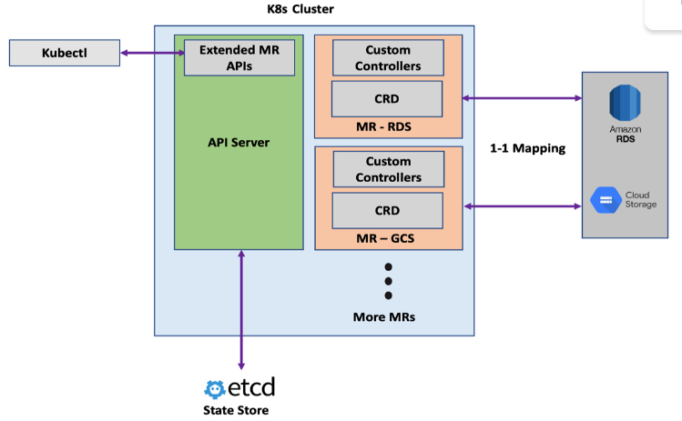
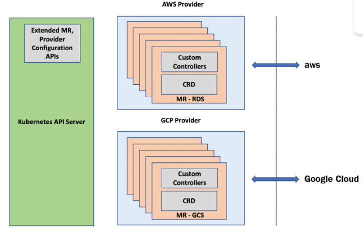
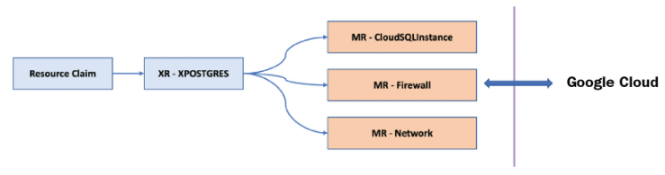
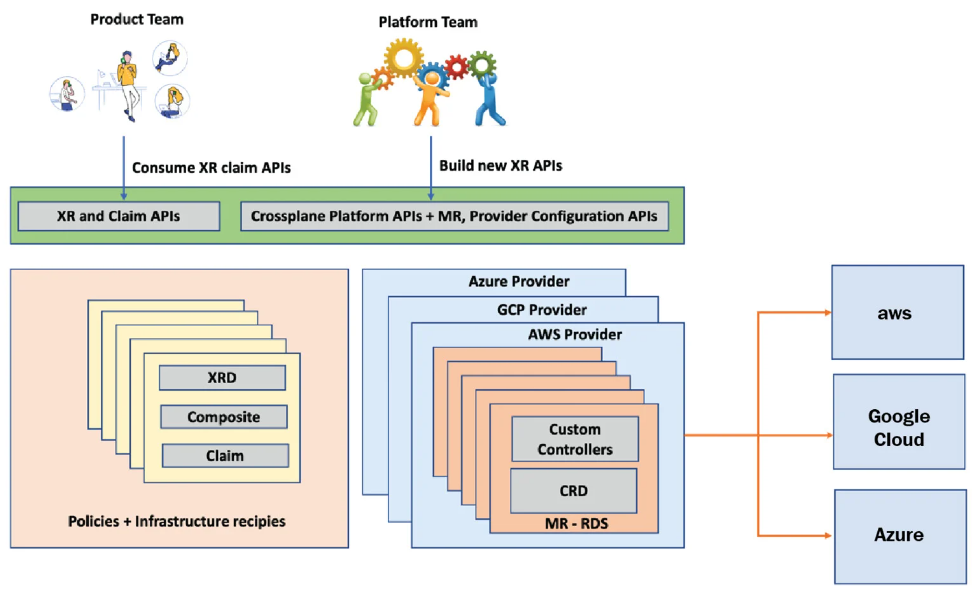
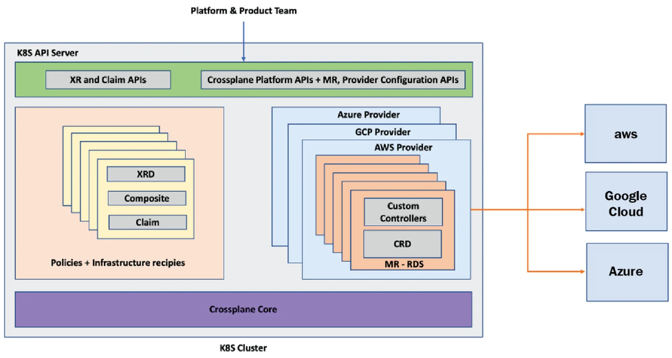

# Automating Infrastructure with Crossplane

## Crossplane Architecture

### Four key components of Crossplane:

- Managed resources
- Providers
- Composite resources
- The Crossplane core

### Managed Resources (MR)

- MR connects a CRD and respective custom controller to represent a single external infrastructure resource
- MRs are in 1-to-1 mapping with infrastructure resources
- Example, CloudSQLInstance is an MR representing `Google Cloud SQL`

- 

### Crossplane Resource Model (XRM)

- Is an open standard used when developing an MR
- XRM is an opinionated extension of the `Kubernetes Resource Model (KRM)`
- The best practise is to compose a higher-level API above an MR to consume
- MR example
```yaml
apiVersion: database.gcp.crossplane.io/v1beta1
kind: CloudSQLInstance
metadata:
  name: my-GCP-DB
spec:
  forProvider:
    databaseVersion: POSTGRES_9_6
    region: asia-south2
    settings:
      tier: db-n1-standard-1
      dataDiskSizeGb: 10
  writeConnectionSecretToRef:
    namespace: DB
    name: my-GCP-DB-credentials
```

- `Late Initialization`: Reconciliation control loop of Crossplane controllers will fill default values assigned by the infrastructure API for the features not provided in the configuration YAML.


## Providers

- Providers are a group of related MRs packaged together as bundle
- Each cloud vendor, other infrastructure services or software tools such as Helm have a provider package
- Format of these packages is nothing, but a container image
- Installing of a provider can be done either with a configuration YAMl or using a Helm package
- If requires a `ProviderConfig` configuration 

## ProviderConfig

- Helps in setting up the infrastructure vendor credentials




*Provider View*

## Composite Resources

- Composing is a way to build our custom infrastructure APIs above one or more MR APIs
- These APIs are called `Composite Resources (XRs)`
- `Composition` and `Composite Resource Definition(XRD)` are the configurations that we use to compose a higher-level `XR API`.
- Composition is the configuration that provides a mapping between the new CRD schema and the existing MRs
- One the new `XR` resource is available, we can start provisioning the infrastructure recipes using a `Resource Claim object`
- The `Claim` API is something that gets created when we add a new XR API, provided we have asked for it in the `XRD` configuration
- The Claim and XR APIs are almost the same with minor differences



*A composite resource*

- The composing layer is for platform teams to build such abstraction



*Product and platform team interaction*

---

## Crossplane core



*All the pieces of Crossplane*

