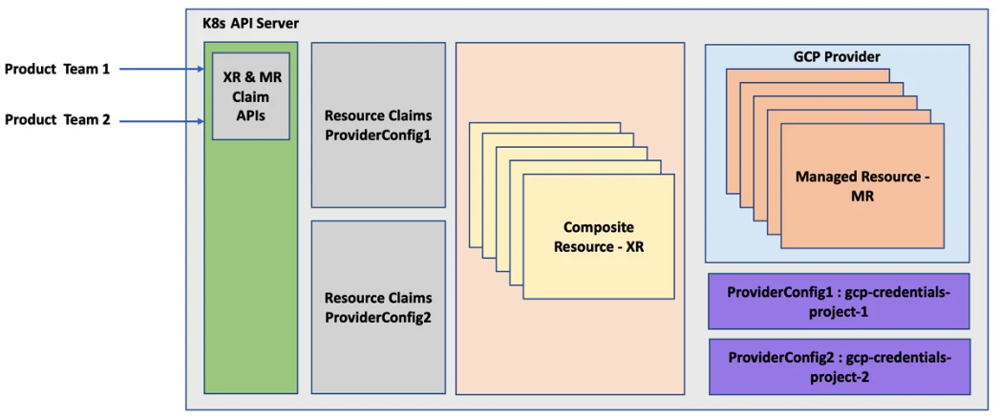
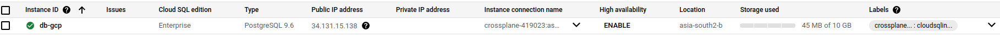

# Automating Infrastructure with Crossplane

## Crossplane Architecture

### Four key components of Crossplane:

- Managed resources
- Providers
- Composite resources
- The Crossplane core

### Managed Resources (MR)

- MR connects a CRD and respective custom controller to represent a single external infrastructure resource
- MRs are in 1-to-1 mapping with infrastructure resources
- Example, CloudSQLInstance is an MR representing `Google Cloud SQL`

- 

### Crossplane Resource Model (XRM)

- Is an open standard used when developing an MR
- XRM is an opinionated extension of the `Kubernetes Resource Model (KRM)`
- The best practise is to compose a higher-level API above an MR to consume
- MR example
```yaml
apiVersion: database.gcp.crossplane.io/v1beta1
kind: CloudSQLInstance
metadata:
  name: my-GCP-DB
spec:
  forProvider:
    databaseVersion: POSTGRES_9_6
    region: asia-south2
    settings:
      tier: db-n1-standard-1
      dataDiskSizeGb: 10
  writeConnectionSecretToRef:
    namespace: DB
    name: my-GCP-DB-credentials
```

- `Late Initialization`: Reconciliation control loop of Crossplane controllers will fill default values assigned by the infrastructure API for the features not provided in the configuration YAML.


## Providers

- Providers are a group of related MRs packaged together as bundle
- Each cloud vendor, other infrastructure services or software tools such as Helm have a provider package
- Format of these packages is nothing, but a container image
- Installing of a provider can be done either with a configuration YAMl or using a Helm package
- If requires a `ProviderConfig` configuration 

## ProviderConfig

- Helps in setting up the infrastructure vendor credentials


*Provider View*

## Composite Resources

- Composing is a way to build our custom infrastructure APIs above one or more MR APIs
- These APIs are called `Composite Resources (XRs)`
- `Composition` and `Composite Resource Definition(XRD)` are the configurations that we use to compose a higher-level `XR API`.
- Composition is the configuration that provides a mapping between the new CRD schema and the existing MRs
- One the new `XR` resource is available, we can start provisioning the infrastructure recipes using a `Resource Claim object`
- The `Claim` API is something that gets created when we add a new XR API, provided we have asked for it in the `XRD` configuration
- The Claim and XR APIs are almost the same with minor differences


*A composite resource*

- The composing layer is for platform teams to build such abstraction


*Product and platform team interaction*

---

## Crossplane core


*All the pieces of Crossplane*

- `CRD` stands for `Custom Resource Definition`, a way to extend the Kubernetes API to support new resource types.
- `CRs` are the resources defined with the CRD. `CR` stands for Custom Resource.
- `XRM` stands for `Crossplane Resource Model`, an extension of the `Kubernetes Resource Model`. It is a set of rules set by Crossplane on how to build an XR or MR.
- `MRs` are nothing but `Managed Resources`, a combination of a CRD and custom controllers in a one-to-one mapping with external infrastructure resources.
- `XRD` stands for `Composite Resource Definition`, a definition for building a custom infrastructure API above Crossplane.
- `XR` stands for `Composite Resource`, which represents a custom infrastructure API built with Crossplane.

---

## Installing Crossplane

```shell
helm repo add crossplane-stable https://charts.crossplane.io/stable
helm repo update
helm install crossplane \
--namespace crossplane-system \
--create-namespace crossplane-stable/crossplane 

k get all -n crossplane-system
NAME                                           READY   STATUS    RESTARTS   AGE
pod/crossplane-57cb498b78-2kkv9                1/1     Running   0          29s
pod/crossplane-rbac-manager-584dc64dd6-g2c7p   1/1     Running   0          29s

NAME                          TYPE        CLUSTER-IP    EXTERNAL-IP   PORT(S)    AGE
service/crossplane-webhooks   ClusterIP   10.96.66.26   <none>        9443/TCP   29s

NAME                                      READY   UP-TO-DATE   AVAILABLE   AGE
deployment.apps/crossplane                1/1     1            1           29s
deployment.apps/crossplane-rbac-manager   1/1     1            1           29s

NAME                                                 DESIRED   CURRENT   READY   AGE
replicaset.apps/crossplane-57cb498b78                1         1         1       29s
replicaset.apps/crossplane-rbac-manager-584dc64dd6   1         1         1       29s

```

## Installing and configuring providers

Prerequisites:

- GCP account
- Installing gcloud cli - https://cloud.google.com/sdk/docs/install
- Creating project in GCP by name `crossplane`
- `gcloud init`
- ```shell
  gcloud config get project
  crossplane-419023
  ```
- Enable the required services
```shell
# Enable Kubernetes APIs , CloudSQL APIs, Network APIs and Compute APIs
gcloud services enable container.googleapis.com
gcloud services enable sqladmin.googleapis.com
gcloud services enable compute.googleapis.com
gcloud services enable servicenetworking.googleapis.com
```

Next, will have to create `service account` and extract the credentials required to set up the GCP Crossplane provider

- Get the project ID:
```shell
gcloud projects list
PROJECT_ID              NAME              PROJECT_NUMBER
crossplane-419023       crossplane        1036492210105
global-road-172213      pheni             494163941067
silicon-pointer-419123  My First Project  634125584066
```

- Create Service Account and enable the required roles on the SA
```shell
gcloud iam service-accounts create crossplane-service-account --display-name "crossplane service account" --project=crossplane-419023
Created service account [crossplane-service-account].

gcloud iam service-accounts list --filter="email ~ ^crossplane-service-account" --format='value(email)'
crossplane-service-account@crossplane-419023.iam.gserviceaccount.com
```

```shell
gcloud projects add-iam-policy-binding crossplane-419023 --member "serviceAccount:crossplane-service-account@crossplane-419023.iam.gserviceaccount.com" --role="roles/iam.serviceAccountUser"

gcloud projects add-iam-policy-binding crossplane-419023 --member "serviceAccount:crossplane-service-account@crossplane-419023.iam.gserviceaccount.com" --role="roles/cloudsql.admin"

gcloud projects add-iam-policy-binding crossplane-419023 --member "serviceAccount:crossplane-service-account@crossplane-419023.iam.gserviceaccount.com" --role="roles/container.admin"

gcloud projects add-iam-policy-binding crossplane-419023 --member "serviceAccount:crossplane-service-account@crossplane-419023.iam.gserviceaccount.com" --role="roles/redis.admin"

gcloud projects add-iam-policy-binding crossplane-419023 --member "serviceAccount:crossplane-service-account@crossplane-419023.iam.gserviceaccount.com" --role="roles/compute.networkAdmin"

gcloud projects add-iam-policy-binding crossplane-419023 --member "serviceAccount:crossplane-service-account@crossplane-419023.iam.gserviceaccount.com" --role="roles/storage.admin"

Updated IAM policy for project [crossplane-419023].
bindings:
- members:
  - serviceAccount:crossplane-service-account@crossplane-419023.iam.gserviceaccount.com
  role: roles/cloudsql.admin
- members:
  - serviceAccount:crossplane-service-account@crossplane-419023.iam.gserviceaccount.com
  role: roles/compute.networkAdmin
- members:
  - serviceAccount:service-1036492210105@compute-system.iam.gserviceaccount.com
  role: roles/compute.serviceAgent
- members:crossplane-rbac-manager-584dc64dd6-g2c7p
  - serviceAccount:crossplane-service-account@crossplane-419023.iam.gserviceaccount.com
  role: roles/container.admin
- members:
  - serviceAccount:service-1036492210105@container-engine-robot.iam.gserviceaccount.com
  role: roles/container.serviceAgent
- members:
  - serviceAccount:service-1036492210105@containerregistry.iam.gserviceaccount.com
  role: roles/containerregistry.ServiceAgent
- members:
  - serviceAccount:1036492210105-compute@developer.gserviceaccount.com
  - serviceAccount:1036492210105@cloudservices.gserviceaccount.com
  role: roles/editor
- members:
  - serviceAccount:crossplane-service-account@crossplane-419023.iam.gserviceaccount.com
  role: roles/iam.serviceAccountUser
- members:
  - user:onlinejob.2411@gmail.com
  role: roles/owner
- members:
  - serviceAccount:service-1036492210105@gcp-sa-pubsub.iam.gserviceaccount.com
  role: roles/pubsub.serviceAgent
- members:
  - serviceAccount:crossplane-service-account@crossplane-419023.iam.gserviceaccount.com
  role: roles/redis.admin
- members:
  - serviceAccount:crossplane-service-account@crossplane-419023.iam.gserviceaccount.com
  role: roles/storage.admin
etag: BwYVIm0YM9k=
version: 1
```

- Extract service account file

```shell
gcloud iam service-accounts keys create crossplane-service-account.json --iam-account crossplane-service-account@crossplane-419023.iam.gserviceaccount.com

created key [ff28a13280bef5fc83ce9fef90f0560d7923c4e4] of type [json] as [crossplane-service-account.json] for [crossplane-service-account@crossplane-419023.iam.gserviceaccount.com]
```

```shell
cat crossplane-service-account.json
```

- Create Kubernetes Secret using the Service Account

```shell
kubectl create secret generic gcp-account -n crossplane-system --from-file=creds=./crossplane-service-account.json
secret/gcp-account created

kubectl get secret gcp-account crossplane-rbac-manager-584dc64dd6-g2c7p-n crossplane-system -o yaml
apiVersion: v1
data:
  creds: ewogICJ0e
kind: Secret
metadata:
  name: gcp-account
  namespace: crossplane-system
  resourceVersion: "357653"
  uid: f56a4eb4-25e1-10364922101054b60-a840-a51d6083be01
type: Opaque
```

## Installing a Provider

- Let's install the GCP Crossplane provider.
- We have 2 options 
  - [From Upbound's Marketplace](https://marketplace.upbound.io/providers/crossplane-contrib/provider-gcp/v0.22.0)
  - [From crossplane-contrib](https://github.com/crossplane-contrib/provider-gcp/tree/master)
    
- Will install GCP Provider with container image version `alpha`
```yaml
cat <<EOF | kubectl apply -f -
apiVersion: pkg.crossplane.io/v1
kind: Provider
metadata:
  name: provider-gcp
spec:
  package: xpkg.upbound.io/crossplane-contrib/provider-gcp:v0.22.0
EOF
provider.pkg.crossplane.io/provider-gcp created
```

```shell
k get po -n crossplane-system
NAME                                        READY   STATUS    RESTARTS        AGE
crossplane-57cb498b78-2kkv9                 1/1     Running   1 (2d16h ago)   3d7h
crossplane-rbac-manager-584dc64dd6-g2c7p    1/1     Running   1 (2d16h ago)   3d7h
provider-gcp-63e92883e260-776757658-crmlr   1/1     Running   0               10h
```

## Configuring Provider

- Next step is to set up provider configuration for authentication using the `ProviderConfig` Crossplane API.
- Credentials can be different for each provider, depending on the construct for authentication by infrastructure vendor.
- GCP, uses `Service Account`, in Azure its `Service Principle`, `IAM` in AWS etc.

```shell
cat <<EOF | kubectl apply -f -
apiVersion: gcp.crossplane.io/v1beta1
kind: ProviderConfig
metadata:
  name: gcp-credentials-project-1
spec:
  credentials:
    secretRef:
      key: service-account
      name: gcp-account
      namespace: crossplane-system
    source: Secret
  projectID: crossplane-419023
EOF
```

```shell
k get providerconfig
NAME                        PROJECT-ID          AGE
gcp-credentials-project-1   crossplane-419023   63m
```

## Multiple Provider configuration

- Multiple `ProviderConfig` can be configured against a provider.
- Which is like having multiple credentials or cloud accounts to access the cloud platform and choosing the appropriate credentials based on the given context
- When provisioning MR or XR, we specify `providerConfigRef` to determine which `ProviderConfig` to use
- If `providerConfigRef` is not provided in Mr or XR, Crossplane refers to the `ProviderConfig` named `default`

```shell
cat <<EOF | kubectl apply -f -
apiVersion: database.gcp.crossplane.io/v1beta1
kind: CloudSQLInstance
metadata:
  name: db-gcp
spec:
  # Reference to use a specific provider config 
  providerConfigRef:
    name: gcp-credentials-project-1
  writeConnectionSecretToRef:
    namespace: crossplane-system
    name: db-conn
  forProvider:
    databaseVersion: POSTGRES_9_6
    region: asia-south2
    settings:
      tier: db-custom-1-3840
      dataDiskSizeGb: 10
EOF
```



*Multiple Provider Configuration*

```shell
kubectl get cloudsqlinstance db-gcp -o yaml | yq eval 'del(.metadata.annotations)' | yq eval 'del(.metadata.managedFields)'
apiVersion: database.gcp.crossplane.io/v1beta1
kind: CloudSQLInstance
metadata:
  creationTimestamp: "2024-04-05T20:59:08Z"
  finalizers:
    - finalizer.managedresource.crossplane.io
  generation: 4
  name: db-gcp
  resourceVersion: "1327628"
  uid: 369f2259-0667-4b24-a799-5d327118dddc
spec:
  deletionPolicy: Delete
  forProvider:
    databaseVersion: POSTGRES_9_6
    gceZone: asia-south2-b
    instanceType: CLOUD_SQL_INSTANCE
    region: asia-south2
    settings:
      activationPolicy: ALWAYS
      availabilityType: ZONAL
      backupConfiguration:
        backupRetentionSettings:
          retainedBackups: 7
          retentionUnit: COUNT
        startTime: "10:00"
      dataDiskSizeGb: 10
      dataDiskType: PD_SSD
      ipConfiguration:
        ipv4Enabled: true
      locationPreference:
        zone: asia-south2-b
      pricingPlan: PER_USE
      replicationType: SYNCHRONOUS
      storageAutoResize: true
      tier: db-custom-1-3840
      userLabels:
        crossplane-kind: cloudsqlinstance_database_gcp_crossplane_io
        crossplane-name: db-gcp
        crossplane-providerconfig: gcp-credentials-project-1
  providerConfigRef:
    name: gcp-credentials-project-1
status:
  atProvider:
    backendType: SECOND_GEN
    connectionName: crossplane-419023:asia-south2:db-gcp
    gceZone: asia-south2-b
    ipAddresses:
      - ipAddress: 34.131.15.138
        type: PRIMARY
      - ipAddress: 34.131.79.183
        type: OUTGOING
    project: crossplane-419023
    selfLink: https://sqladmin.googleapis.com/sql/v1beta4/projects/crossplane-419023/instances/db-gcp
    serviceAccountEmailAddress: p1036492210105-8jl0z0@gcp-sa-cloud-sql.iam.gserviceaccount.com
    settingsVersion: 14
    state: RUNNABLE
  conditions:
    - lastTransitionTime: "2024-04-08T08:31:06Z"
      reason: ReconcileSuccess
      status: "True"
      type: Synced
    - lastTransitionTime: "2024-04-08T08:33:07Z"
      reason: Available
      status: "True"
      type: Ready
```



```shell
kubectl get cloudsqlinstance db-gcp 
NAME     READY   SYNCED   STATE      VERSION        AGE
db-gcp   True    True     RUNNABLE   POSTGRES_9_6   2d13h
```

## Cleanup

```shell
kubectl delete cloudsqlinstance db-gcp 
cloudsqlinstance.database.gcp.crossplane.io "db-gcp" deleted
```

--- 

Tip:
```shell
If you want to create the resource in the vendor infrastructure with a name different from that of the Crossplane resource claim, use the crossplane.io/external-name:my-special-name annotation in the metadata section.
```