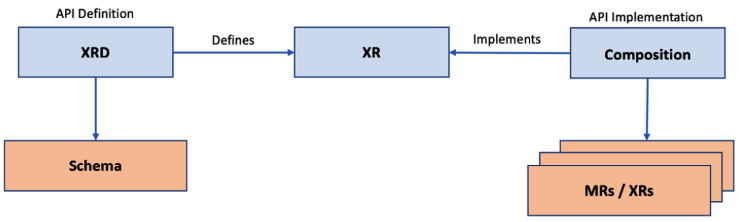
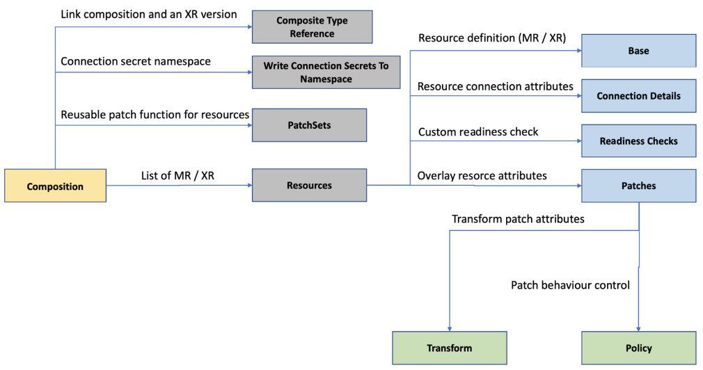
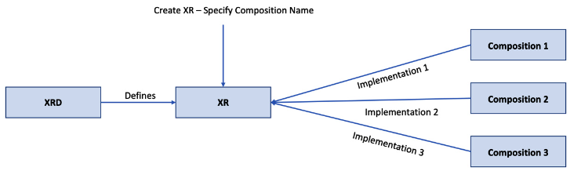
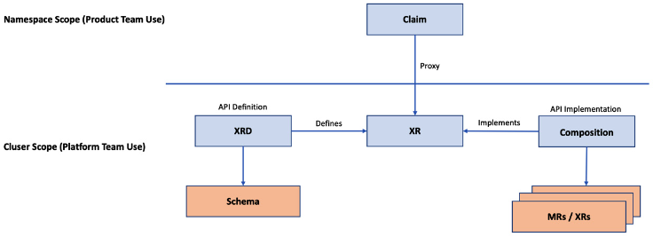
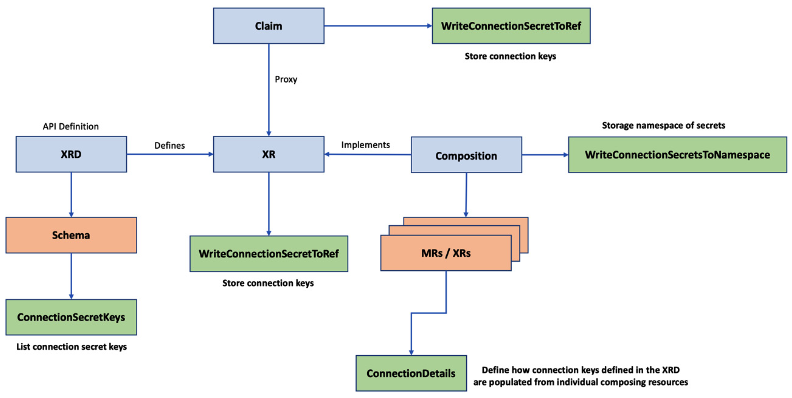

# Composing Infrastructure with Crossplane


## Components in an XR

- XRD (Composite Resource Definition)
- Composition
- Claim

## XRD (Composite Resource Definition)

- Is the schema defining the infrastructure API specification
- Is like an OpenAPI Specification or Swagger API definition
  
- `The XR names` Infrastructure API name in singular and plural format
  - The singular name will eventually become the `kind` attribute of the new API
  - Note: It's standard practise to use `X` as prefix for the XR name
- `API group` group the APIs logically
- `Metadata name` Concatenation of the plural name of XR and a dot followed by the API group.
  - `<resource plural name>.<API group>`
- `Versions` Array that can hold configuration for multiple versions of the same `XR` API
- `served and referenceable` Mandatory Boolean attributes for every defined version.
  - `served` indicates if XR API is served with the given version
  - `referenceable` flag, determines if we can define an implementation for the given API version 
- `Schema` Actual OpenAPI specification
- `Connection secret keys` list of keys that need to be created and populated in the k8s Secrets after the resource provisioning
- `Composition reference` We can have multiple API implementations for the given XRD
  - And this section of XRD will help to define the default implementation or enforced implementation
  - `DefaultCompositionRef` and `EnforcedCompositionRef`
- `Claim names` Optional
  - Creates a proxy API for the given XR API with specified name
  - Applying the claim object's create, delete, and update action will create, delete, and update the underlying XR  
    
- [API Documentation](https://doc.crds.dev/github.com/crossplane/crossplane)

```yaml
apiVersion: apiextensions.crossplane.io/v1
kind: CompositeResourceDefinition
metadata:
  #'<plural>.<group>'
  name: xclouddbs.book.imarunrk.com
spec:
  # API group
  group: book.imarunrk.com
  # Singular name and plural name.
  names:
    kind: xclouddb
    plural: xclouddbs
  # Optional parameter to create namespace proxy claim API
  claimNames:
    kind: Clouddb
    plural: Clouddbs
  # Start from alpha to beta to production to deprecated.
  versions:
  - name: v1
    # Is the specific version actively served
    served: true
    # Can the version be referenced from an API implementation
    referenceable: true
    # OpenAPI schema 
    schema:
      openAPIV3Schema:
        type: object
        properties:
          spec:
            type: object
            properties:
              parameters:
                type: object
                properties:
                  storageSize:
                    type: integer
                required:
                - storageSize
            required:
            - parameters
```

## Composition

- Composition will link one or more MRs with an XR API
- We can consider XRD as the CRD and `composition` as the custom controller implementation
- We can use XR to refer to a new infrastructure API that we're building
- Also, the composition resources list can hold both an `MR` and an existing `XR`


*XRM, composition, and XR*

- XRD define what XR would be created
- Composition implements XRs and MRs both

## Composition configuration

- `CompositeTypeRef` maps a specific XR version with the current composition
- `WriteConnectionSecretsToNamespace` specifies namespace for storing the connection Secrets
- `Resources` holds list of MRs. 
  - We can define another XR under this section
  - A mandatory section, and should define at least one resource, either an MR or XR
- `Patches` provided under a given resource which helps to overlay the API input attributes to the composing resource(MR/XR) attributes
  - Predefined types of patches, `FromCompositeFieldPath (default)`, `ToCompositeFieldPath`, `CombineFromComposite`, [more](https://docs.crossplane.io/latest/concepts/patch-and-transform/#types-of-patches)
  - [Patch](https://docs.crossplane.io/latest/concepts/patch-and-transform/#create-a-patch)
- `Transforms` When applying a patch, Crossplane supports modifying the data before applying it as a patch - `transform` operation.  
  - These are predefined functions, such as `convert`, `math`, `map` etc
  - [ref](https://docs.crossplane.io/latest/concepts/patch-and-transform/#transform-a-patch)
- `Policy` are under each path and determines patching behaviour
  - We can mandate the patch path presence because the default behaviour is to skip the patch if the field is absent
  - [ref](https://docs.crossplane.io/latest/concepts/patch-and-transform/#patch-policies)
- `ConnectionDetails` specified under each resource and will hold the list of secret keys we want to propagate back into the XR
- `ReadinessChecks` allow us to define any custom readiness logic
- `PatchSets` Set of reusable patch functions that can be used across multiple resources. (Shared reusable function)



*Composition Configuration*

```yaml
apiVersion: apiextensions.crossplane.io/v1
kind: Composition
metadata:
  name: xclouddb-composition
spec:
  # Link Composition to a specific XR and version
  compositeTypeRef:
    apiVersion: xclouddb.book.imarunrk.com/v1
    kind: Xclouddb
  # Connection secrets namespace
  writeConnectionSecretsToNamespace: crossplane-system
  # List of composed MRs or XRs.
  resources:
  - name: clouddbInstance
    # Resource base template
    base:
      apiVersion: database.gcp.crossplane.io/v1beta1
      kind: CloudSQLInstance
      spec:
        forProvider:
          databaseVersion: POSTGRES_9_6
          region: us-central
          settings:
            tier: db-g1-small
            dataDiskSizeGb: 20
    # Resource patches 
    patches:
    - type: FromCompositeFieldPath
      fromFieldPath: spec.parameters.storageSize
      toFieldPath: spec.forProvider.settings.dataDiskSizeGb
    # Resource secrets
    connectionDetails:
    - name: hostname
      fromConnectionSecretKey: hostname
```

- An `XRD` version can have more than one composition
- For example, we could have different compositions defined for production and staging
- `CompositionRef` within XR can refer to a specific composition
- `CompositionSelector` can be used to match compositions based on labels



*XR and composition relation*


## Claim

- Is a proxy API to the XR, created by providing claim name attributes in XRD configurations
- Above, `xclouddb` is the XR name and `Clouddb` is the claim name
- This convention is not mandatory
- Claims are very similar to th XR

- XRs are cluster-level resources
  - We can keep some XR only as a private API at the cluster level for the platform team's use
  - Example, platform team may not be interested in exposing the XR API that creates a virtual private network
- Claims are namespace level
  - Enables namespace level authorization
  - Example, we can assign different permissions for different product teams based on their namespace ownership
  
- This pattern an be ued to support the preprovisioning of infrastructure.
  - A claim can just reference itself with a preprovisioned XR infrastructure, keeping the provisioning time low.



*How does composition work?*

- Claim yaml:
```yaml
apiVersion: book.imarunrk.com/v1
# Kind name matches the singular claim name in the XRD
kind: Clouddb
metadata:
  name: cloud-db
  namespace: default
spec:
  # Parameters to be mapped and patched in the composition 
  parameters:
    storageSize: 20
  # Name of the composition to be used
  compositionRef:
    name: xclouddb-composition
  writeConnectionSecretToRef:
    namespace: crossplane-system
    name: db-conn
```

- XR yaml:
```yaml
apiVersion: book.imarunrk.com/v1
kind: XClouddb
metadata:
  name: cloud-db
spec:
  parameters:
    storageSize: 20
  compositionRef:
    name: xclouddb-composition
  writeConnectionSecretToRef:
    namespace: crossplane-system
    name: db-conn
```
- XR is always at cluster level


## Postprovisioning of an XR

- Readiness check
  - Every resource element in the composition can define its custom readiness logic
  - `MatchString`
    - ```yaml
      - type: MatchString
        fieldPath: status.atProvider.state
        matchString: "Online"
      ```
  - `MatchInteger`  
    - ```yaml
      - type: MatchInteger
        fieldPath: status.atProvider.state
        matchInteger: 1
      ```
  - `None`        
    - Use the None type to consider the readiness as soon as the resource is available:
      - `- type: None`
  - `NonEmpty`      
    - Use NonEmpty to make the resource ready as soon as some value exists in the field of our choice.
      - ```yaml
        - type: NonEmpty
          fieldPath: status.atProvider.state
        ```
  - Note that fieldPath falls under the status attribute
  
- Patch status
  - `ToCompositeFieldPath` is a patch type for copying any attribute from a specific composed resource back into the XR
  - First, we need to define the state fields as a part of openAPIV3Schema in the XRD to make the new status fields available in the XR
  - The next step is to define a patch under the specific composing resource
  - ```yaml
    - type: ToCompositeFieldPath
      fromFieldPath: status.atProvider.currentDiskSize
      toFieldPath: status.dbDiskSize
    ```
  - We can also use the `CombineToComposite` patch type if we need to copy a combination of multiple fields.  

- Propagating the credentials back
  - Connection secret-related configuration is part of the XRD, XR, claim, and composition
  - Define the list of connection secret keys in the XRD using the `ConnectionSecretKeys` configuration
  - Configure the composing resources to define how to populate connection keys defined in the XRD. Connection details configuration can be of different types. The FromConnectionSecretKey type is correct when copying the secret from an existing secret key 
  - We have the FromFieldPath type for copying the connection details from one of the composing resource fields
  - The claim or XR should save the Secrets using the `WriteConnectionSecretToRef` configuration
  

*Propagating the Secrets*


## Preprovisioned Resources

- Cache the composed recourses 
  - The platform team can provision an XR and keep the resources in the resource pool. 
  - Then, the product team can claim these resources by adding the `ResourceRef` configuration under the spec of a claim YAML.

- Importing existing resources from the external provider into the Crossplane
  - `crossplane.io/external-name` annotation can help with this
  - MR Yaml example, onboarding existing PVC
  - ```yaml
    apiVersion: compute.gcp.crossplane.io/v1beta1
    kind: Network
    metadata:
      name: alpha-beta-vpc-crossplane-ref
      annotations:
        # Annotation to provide existing resource named
        crossplane.io/external-name: alpha-beta-vpc
    spec:
      providerConfigRef:
        name: gcp-credentials-project-1
      # Provide the required parameters same as external resource.
      forProvider:
        autoCreateSubnetworks: true
    ```
  - What we achieve here is to map the manual resource to a Claim


