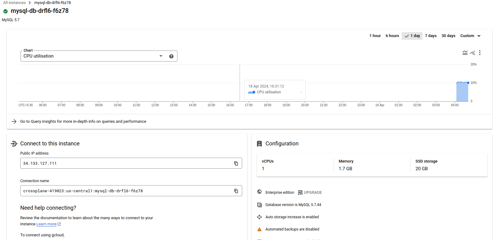

# Building an XR

- Infrastructure API requirement
  - `Compliance policy` provisioning should be done in `us-central` region
  - `Architecture policy` should support 2 tiers of the database
    - `Small` disk size 20 GB
    - `Big` disk size 40 GB
  - `Archtecture policy`:
    - `Small` tier's VM should be `db-g1-small`
    - `Big` tier's VM should be `db-n1-standard-1`
  - `Product team` option to choose between `Postgres` and `MySQL`
  - `Product team` should specify the size in the XR with 2 enums (`SMALL` or `BIG`)
  - `Platform team` Patch the zone in which the database is created back into the `XR/claim` status field for monitoring requirements
    
## Creating the XRD

- `Api Group`: `alpha-beta.imarunrk.com`
- `XR` name: `XGCPdb`
- `Claim` name: `GCPdb`
- `API` version: `v1`
- `size` as input parameter
- `zone` as response status attribute

```yaml
cat <<EOF | kubectl apply -f -
apiVersion: apiextensions.crossplane.io/v1
kind: CompositeResourceDefinition
metadata:
  #'<plural name>.<group>'
  name: xgcpdbs.alpha-beta.imarunrk.com
spec:
  # We will group the APIs under the alpha-beta group 
  group: alpha-beta.imarunrk.com
  # Singular name and plural name of GCP DB.
  names:
    kind: XGCPdb
    plural: xgcpdbs
  # Providing the claim API name for the product team
  claimNames:
    kind: GCPdb
    plural: gcpdbs
  # We will start with version v1 for the first release.
  versions:
  - name: v1
    # This is an actively served version
    served: true
    # We should be able to create composition for this version 
    referenceable: true
    # OpenAPI schema 
    schema:
      openAPIV3Schema:
        type: object
        properties:
          spec:
            type: object
            properties:
              # Size will be a user input
              parameters:
                type: object
                properties:
                  size:
                    type: string
                required:
                - size
            required:
            - parameters
          status:
            type: object
            # Recourse zone - status patch parameter.
            properties:
              zone:
                description: DB zone.
                type: string
EOF
```

```shell
kubectl get xrd
NAME                              ESTABLISHED   OFFERED   AGE
xgcpdbs.alpha-beta.imarunrk.com   True          True      21s
```

- ESTABLISHED and OFFERED flags in the screenshot are True
  - This means that the XRD is created correctly
  - If these statuses are not True, use kubectl to describe the details of the XRD and look for an error
    

## Providing implementation

- Provide an API implementation (provide composition configuration)
- Polymorphic behavior - will create 2 compositions one for Postgres and MySQL

The following are the steps to remember when we build the composition YAML:

- Refer to the v1 XRD API version with the CompositeTypeRef configuration.
- Define the CloudSQLInstance configuration under the resource base.
- Hardcode the region to us-central1 to meet the compliance requirement.
- The database tier and disk size will hold default values, but the patch configuration will overlay them using the FromCompositeFieldPath patch type.
- Use the Map transformation to convert the SMALL tier size to the db-g1-small machine tier. Use the Map and Convert transformations to map the SMALL tier size to the 20 GB disk size.
- Similar mapping will be done for the BIG configuration.
- Patch the GceZone attribute from the MR status to the XR/claim for monitoring. We can achieve this using the ToCompositeFieldPath patch type.
- Provide a mapping between the MR connection secret key to the XR/claim keys with the ConnectionDetails configuration.

## Postgres Composition

```yaml
cat <<EOF | kubectl apply -f -
apiVersion: apiextensions.crossplane.io/v1
kind: Composition
metadata:
  name: postgres
  labels:
    # An optional label used for easy discovery
    crossplane.io/xrd: xgcpdbs.alpha-beta.imarunrk.com
spec:
  # Refer to an XRD API version
  compositeTypeRef:
    apiVersion: alpha-beta.imarunrk.com/v1
    kind: XGCPdb
  writeConnectionSecretsToNamespace: crossplane-system
  resources:
    # Provide configuration for Postgres resource
  - name: cloudsqlinstance
    base:
      apiVersion: database.gcp.crossplane.io/v1beta1
      kind: CloudSQLInstance
      spec:
        # reference to GCP credentials
        providerConfigRef:
          name: gcp-credentials-project-1
        forProvider:
          databaseVersion: POSTGRES_9_6
          # Complience Policy
          region: us-central1
          settings:
            # These are default values 
            # We will patch this to match architecture policy 
            tier: db-g1-small
            dataDiskSizeGb: 20
    patches:
      # Patch tier in composition from XR/Claim 
    - type: FromCompositeFieldPath
      fromFieldPath: spec.parameters.size
      toFieldPath: spec.forProvider.settings.tier
      # Use map transform
      # If the from-field value is BIG, then 
      # the mapped to-field value is db-n1-standard-1
      transforms:
      - type: map
        map:
          BIG: db-n1-standard-1
          SMALL: db-g1-small
      policy:
        # return error if there is no field.
        fromFieldPath: Required
      # Patch disk size in composition from XR/Claim 
    - type: FromCompositeFieldPath
      fromFieldPath: spec.parameters.size
      toFieldPath: spec.forProvider.settings.dataDiskSizeGb
      # If the from-field value is BIG, then 
      # the mapped to-field value is '40;
      # Apply the second transform to convert '40' to int
      transforms:
      - type: map
        map:
          BIG: "40"
          SMALL: "20"
      - type: convert
        convert:
          toType: int
      policy:
        # return error if there is no field.
        fromFieldPath: Required
    # Patch zone information back to the XR status
    # No transformation or policy required
    - type: ToCompositeFieldPath
      fromFieldPath: status.atProvider.gceZone
      toFieldPath: status.zone
    # Propagating CloudSQLInstance connection secret to the XR
    connectionDetails:
    - name: hostname
      fromConnectionSecretKey: hostname
EOF
```

## MySQL Composition

```yaml
cat <<EOF | kubectl apply -f -
apiVersion: apiextensions.crossplane.io/v1
kind: Composition
metadata:
  name: mysql
  labels:
    # An optional label used for easy discovery
    crossplane.io/xrd: xgcpdbs.alpha-beta.imarunrk.com
spec:
  # Refer a XRD API version
  compositeTypeRef:
    apiVersion: alpha-beta.imarunrk.com/v1
    kind: XGCPdb
  writeConnectionSecretsToNamespace: crossplane-system
  resources:
    # Provide configuration for Postgres resource
  - name: cloudsqlinstance
    base:
      apiVersion: database.gcp.crossplane.io/v1beta1
      kind: CloudSQLInstance
      spec:
        # reference to GCP credentials
        providerConfigRef:
          name: gcp-credentials-project-1
        forProvider:
          databaseVersion: MYSQL_5_7
          # Complience Policy
          region: us-central1
          settings:
            # These are default values 
            # We will patch this to match architecture policy 
            tier: db-g1-small
            dataDiskSizeGb: 20
    patches:
      # Patch tier in composition from XR/Claim 
    - type: FromCompositeFieldPath
      fromFieldPath: spec.parameters.size
      toFieldPath: spec.forProvider.settings.tier
      # Use map transform
      # If the from-field value is BIG, then 
      # the mapped to-field value is db-n1-standard-1
      transforms:
      - type: map
        map:
          BIG: db-n1-standard-1
          SMALL: db-g1-small
      policy:
        # return error if there is no field.
        fromFieldPath: Required
      # Patch disk size in composition from XR/Claim 
    - type: FromCompositeFieldPath
      fromFieldPath: spec.parameters.size
      toFieldPath: spec.forProvider.settings.dataDiskSizeGb
      # If the from-field value is BIG, then 
      # the mapped to-field value is '40;
      # Apply the second transform to convert '40' to int
      transforms:
      - type: map
        map:
          BIG: "40"
          SMALL: "20"
      - type: convert
        convert:
          toType: int
      policy:
        # return error if there is no field.
        fromFieldPath: Required
    # Patch zone information back to the XR status
    # No transformation or policy required
    - type: ToCompositeFieldPath
      fromFieldPath: status.atProvider.gceZone
      toFieldPath: status.zone
    # Propagating CloudSQLInstance connection secret to the XR
    connectionDetails:
    - name: hostname
      fromConnectionSecretKey: hostname
EOF
```

```shell
kubectl get compositions
NAME       XR-KIND   XR-APIVERSION                AGE
mysql      XGCPdb    alpha-beta.imarunrk.com/v1   5s
postgres   XGCPdb    alpha-beta.imarunrk.com/v1   84s
```

## Provisioning the resources with a claim

- With help of compositions we can provision GCP database with an XR or a claim
- Claims are namespace resources, will provision it in `alpha` namespace

## MySQL claim

```yaml
cat <<EOF | kubectl apply -f -
apiVersion: alpha-beta.imarunrk.com/v1
kind: GCPdb
metadata:
  # Claims in alpha namespace
  namespace: alpha
  name: mysql-db
spec:
  # refer to the mysql composition
  compositionRef:
    name: mysql
  # save connection details as secret - db-conn
  writeConnectionSecretToRef:
    name: db-conn2
  parameters:
    size: SMALL
EOF
```

```shell
kubectl get cloudsqlinstance
NAME                   READY   SYNCED   STATE      VERSION     AGE
mysql-db-drfl6-f6z78   True    True     RUNNABLE   MYSQL_5_7   18m

kubectl get gcpdb -n alpha
NAME       SYNCED   READY   CONNECTION-SECRET   AGE
mysql-db   True     True    db-conn2            18m
```

```yaml
 k get cloudsqlinstance mysql-db-drfl6-f6z78 -o yaml
apiVersion: database.gcp.crossplane.io/v1beta1
kind: CloudSQLInstance
metadata:
  annotations:
    crossplane.io/composition-resource-name: cloudsqlinstance
    crossplane.io/external-create-pending: "2024-04-18T22:25:06Z"
    crossplane.io/external-create-succeeded: "2024-04-18T22:25:11Z"
    crossplane.io/external-name: mysql-db-drfl6-f6z78
  creationTimestamp: "2024-04-18T22:25:04Z"
  finalizers:
  - finalizer.managedresource.crossplane.io
  generateName: mysql-db-drfl6-
  generation: 3
  labels:
    crossplane.io/claim-name: mysql-db
    crossplane.io/claim-namespace: alpha
    crossplane.io/composite: mysql-db-drfl6
  name: mysql-db-drfl6-f6z78
  ownerReferences:
  - apiVersion: alpha-beta.imarunrk.com/v1
    blockOwnerDeletion: true
    controller: true
    kind: XGCPdb
    name: mysql-db-drfl6
    uid: 00ea1469-4880-41b5-bb45-0b669b9063a6
  resourceVersion: "2855845"
  uid: 31fd6a31-5da0-4567-821c-acf429f62a0c
spec:
  deletionPolicy: Delete
  forProvider:
    databaseVersion: MYSQL_5_7
    gceZone: us-central1-a
    instanceType: CLOUD_SQL_INSTANCE
    region: us-central1
    settings:
      activationPolicy: ALWAYS
      availabilityType: ZONAL
      backupConfiguration:
        backupRetentionSettings:
          retainedBackups: 7
          retentionUnit: COUNT
        startTime: "08:00"
      dataDiskSizeGb: 20
      dataDiskType: PD_SSD
      ipConfiguration:
        ipv4Enabled: true
      locationPreference:
        zone: us-central1-a
      pricingPlan: PER_USE
      replicationType: SYNCHRONOUS
      storageAutoResize: true
      tier: db-g1-small
      userLabels:
        crossplane-kind: cloudsqlinstance_database_gcp_crossplane_io
        crossplane-name: mysql-db-drfl6-f6z78
        crossplane-providerconfig: gcp-credentials-project-1
  providerConfigRef:
    name: gcp-credentials-project-1
status:
  atProvider:
    backendType: SECOND_GEN
    connectionName: crossplane-419023:us-central1:mysql-db-drfl6-f6z78
    gceZone: us-central1-a
    ipAddresses:
    - ipAddress: 34.133.127.111
      type: PRIMARY
    project: crossplane-419023
    selfLink: https://sqladmin.googleapis.com/sql/v1beta4/projects/crossplane-419023/instances/mysql-db-drfl6-f6z78
    serviceAccountEmailAddress: p1036492210105-uvef50@gcp-sa-cloud-sql.iam.gserviceaccount.com
    settingsVersion: 1
    state: RUNNABLE
  conditions:
  - lastTransitionTime: "2024-04-18T22:30:18Z"
    reason: Available
    status: "True"
    type: Ready
  - lastTransitionTime: "2024-04-18T22:25:11Z"
    reason: ReconcileSuccess
    status: "True"
    type: Synced

```

```yaml
apiVersion: alpha-beta.imarunrk.com/v1
kind: GCPdb
metadata:
  annotations:
    kubectl.kubernetes.io/last-applied-configuration: |
      {"apiVersion":"alpha-beta.imarunrk.com/v1","kind":"GCPdb","metadata":{"annotations":{},"name":"mysql-db","namespace":"alpha"},"spec":{"compositionRef":{"name":"mysql"},"parameters":{"size":"SMALL"},"writeConnectionSecretToRef":{"name":"db-conn2"}}}
  creationTimestamp: "2024-04-18T22:25:03Z"
  finalizers:
  - finalizer.apiextensions.crossplane.io
  generation: 4
  name: mysql-db
  namespace: alpha
  resourceVersion: "2855893"
  uid: 58491203-c1a5-46f1-a5e3-8fd0f0f32214
spec:
  compositeDeletePolicy: Background
  compositionRef:
    name: mysql
  compositionRevisionRef:
    name: mysql-ab55226
  compositionUpdatePolicy: Automatic
  parameters:
    size: SMALL
  resourceRef:
    apiVersion: alpha-beta.imarunrk.com/v1
    kind: XGCPdb
    name: mysql-db-drfl6
  writeConnectionSecretToRef:
    name: db-conn2
status:
  conditions:
  - lastTransitionTime: "2024-04-18T22:25:04Z"
    reason: ReconcileSuccess
    status: "True"
    type: Synced
  - lastTransitionTime: "2024-04-18T22:30:36Z"
    reason: Available
    status: "True"
    type: Ready
  connectionDetails:
    lastPublishedTime: "2024-04-18T22:30:36Z"
  zone: us-central1-a
```



- The debugging order will be claim, then XR, and then each composing resource. We should start with a claimed object. If we cannot locate the issue, we go deep into the XR and then the composing resources.
- spec.resourceRef from the claim description can help us to identify the XR name. Again, the same attribute can be used to find the composing resources from the XR.

## Cleanup

```yaml
kubectl delete claim mysql-db -n alpha
gcpdb.alpha-beta.imarunrk.com "mysql-db" deleted
```
