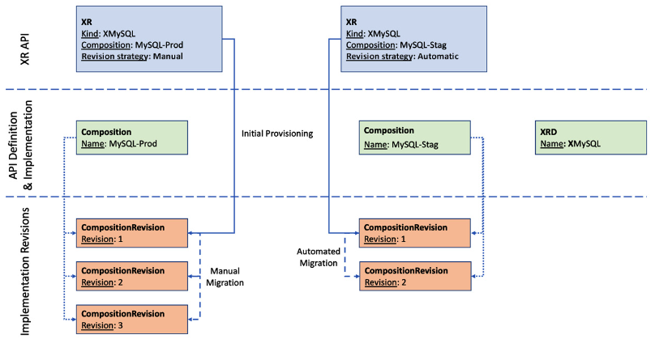
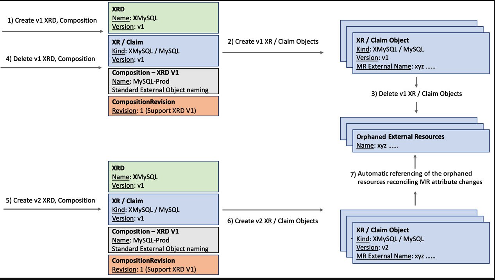
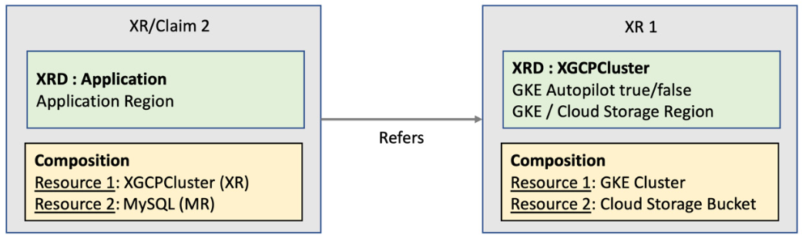

# Platform Patterns

## Evolving APIs

### API implementation change

- `CmpositionRevision` is Crossplane concept that will work with compositions to support changes
- If the `--enable-composition-revisions` flag is set while installing Crossplane, a CompositionRevision object is created with all the updates to composition
- The compositions are mutable objects that can change forever, but individual CompositionRevision is immutable
- Composition and CompositionRevision are in one-to-many relationships
- Only one CompositionRevision active at any given instance
- In a Crossplane environment where the composition revision flag is enabled, we will have two attributes automatically added to every XR/Claim object by Crossplane
  - `spec.compositionRevisionRef` This will hold the name of CompositionRevision with which the resources are created
  - `spec.compositionUpdatePolicy` This attribute will indicate whether the XR/Claim will automatically migrate to a new, available CompositionRevision. Manual and automatic are the two possible values, with automatic as the default value. If you would like to override the default behavior, add this attribute with a manual indicator in the XR/Claim configuration.  
    


## Enable Composition Revisions

```shell
helm upgrade crossplane --namespace crossplane-system crossplane-stable/crossplane --set args='{--enable-composition-revisions}'
```

- Let's try
  - Building an XR API for GCP MySQL provisioning in a composition revision-enabled Crossplane environment
  - Creating two MySQL instances with automated and manual composition revision policies
  - Updating the Composition to change the calculation for database disk size
  - Validating if the MySQL instance with automated revision policy automatically migrates to the latest composition revision
  - Seeing that the MySQL instance with the manual revision policy does not migrate to the latest composition revision
  - Finally, migrating the second MySQL instance manually to the latest composition revision
    

```yaml
cat <<EOF | kubectl apply -f -
apiVersion: apiextensions.crossplane.io/v1
kind: CompositeResourceDefinition
metadata:
  name: xmysqls.composition-revision.imarunrk.com
spec:
  group: composition-revision.imarunrk.com
  names:
    kind: XMySql
    plural: xmysqls
  claimNames:
    kind: MySql
    plural: mysqls
  versions:
  - name: v1
    served: true
    referenceable: true
    schema:
      openAPIV3Schema:
        type: object
        properties:
          spec:
            type: object
            properties:
              parameters:
                type: object
                properties:
                  size:
                    type: integer
                required:
                - size
            required:
            - parameters
EOF
```

```yaml
cat <<EOF | kubectl apply -f -
apiVersion: apiextensions.crossplane.io/v1
kind: Composition
metadata:
  name: gcp-mysql
spec:
  compositeTypeRef:
    apiVersion: composition-revision.imarunrk.com/v1
    kind: XMySql
  resources:
  - name: cloudsqlinstance
    base:
      apiVersion: database.gcp.crossplane.io/v1beta1
      kind: CloudSQLInstance
      spec:
        providerConfigRef:
          name: gcp-credentials-project-1
        forProvider:
          region: us-central1
          databaseVersion: MYSQL_5_7
          settings:
            tier: db-g1-small
            dataDiskSizeGb: 40
    patches:
    - type: FromCompositeFieldPath
      fromFieldPath: spec.parameters.size
      toFieldPath: spec.forProvider.settings.dataDiskSizeGb
EOF
```

```shell
k get compositionrevision -l crossplane.io/composition-name=gcp-mysql
NAME                REVISION   XR-KIND   XR-APIVERSION                          AGE
gcp-mysql-8e5f8dc   1          XMySql    composition-revision.imarunrk.com/v1   11m
```

```yaml
cat <<EOF | k apply -f -
apiVersion: composition-revision.imarunrk.com/v1
kind: MySql
metadata:
  namespace: alpha
  name: mysql-db-manual
spec:
  compositionUpdatePolicy: Manual
  compositionRef:
    name: gcp-mysql
  parameters:
    size: 10
EOF
```

```yaml
cat <<EOF | k apply -f -
apiVersion: composition-revision.imarunrk.com/v1
kind: MySql
metadata:
  namespace: alpha
  name: mysql-db
spec:
  compositionRef:
    name: gcp-mysql
  parameters:
    size: 10
EOF
```

```shell
k get claim -A
NAMESPACE   NAME                                                      SYNCED   READY   CONNECTION-SECRET   AGE
alpha       mysql.composition-revision.imarunrk.com/mysql-db          True     False                       14s
alpha       mysql.composition-revision.imarunrk.com/mysql-db-manual   True     False                       2m33s
```

```yaml
kubectl get mysql mysql-db-manual -o yaml -n alpha | k neat
apiVersion: composition-revision.imarunrk.com/v1
kind: MySql
metadata:
  name: mysql-db-manual
  namespace: alpha
spec:
  compositeDeletePolicy: Background
  compositionRef:
    name: gcp-mysql
  compositionUpdatePolicy: Manual
  parameters:
    size: 10
  resourceRef:
    apiVersion: composition-revision.imarunrk.com/v1
    kind: XMySql
    name: mysql-db-manual-p27v4
```

```yaml
kubectl get mysql mysql-db -o yaml -n alpha | k neat
apiVersion: composition-revision.imarunrk.com/v1
kind: MySql
metadata:
  name: mysql-db
  namespace: alpha
spec:
  compositeDeletePolicy: Background
  compositionRef:
    name: gcp-mysql
  compositionRevisionRef:
    name: gcp-mysql-8e5f8dc
  compositionUpdatePolicy: Automatic
  parameters:
    size: 10
  resourceRef:
    apiVersion: composition-revision.imarunrk.com/v1
    kind: XMySql
    name: mysql-db-wjmvl
```

- Update composition patch with transform function
```yaml
cat <<EOF | kubectl apply -f -
apiVersion: apiextensions.crossplane.io/v1
kind: Composition
metadata:
  name: gcp-mysql
spec:
  compositeTypeRef:
    apiVersion: composition-revision.imarunrk.com/v1
    kind: XMySql
  resources:
  - name: cloudsqlinstance
    base:
      apiVersion: database.gcp.crossplane.io/v1beta1
      kind: CloudSQLInstance
      spec:
        providerConfigRef:
          name: gcp-credentials-project-1
        forProvider:
          region: us-central1
          databaseVersion: MYSQL_5_7
          settings:
            tier: db-g1-small
            dataDiskSizeGb: 40
    patches:
    - type: FromCompositeFieldPath
      fromFieldPath: spec.parameters.size
      toFieldPath: spec.forProvider.settings.dataDiskSizeGb
      transforms:
      - type: math
        math:
          multiply: 4
EOF
```

```shell
 k get compositionrevision -l crossplane.io/composition-name=gcp-mysql
NAME                REVISION   XR-KIND   XR-APIVERSION                          AGE
gcp-mysql-8e5f8dc   1          XMySql    composition-revision.imarunrk.com/v1   12h
gcp-mysql-f7ea509   2          XMySql    composition-revision.imarunrk.com/v1   6h50m
```

```yaml
kind: MySql
metadata:
  name: mysql-db
  namespace: alpha
spec:
  ...
  compositionRevisionRef:
    name: gcp-mysql-8e5f8dc
```

- For manual upgrade update `mysql-db-manual` with the latest `compositionRevisionRef`
```yaml
  compositionRevisionRef:
    name: gcp-mysql-cf3862c
```

## API contract changes

### Non-breaking changes

- A simple way to think about this is that if Composition/CompositionRevision can handle the co-existence of old and newly provisioned resources, then the XRD contract change is non-breaking

```yaml
cat <<EOF | kubectl apply -f -
apiVersion: apiextensions.crossplane.io/v1
kind: CompositeResourceDefinition
metadata:
  name: xmysqls.xrd-non-breaking.imarunrk.com
spec:
  group: xrd-non-breaking.imarunrk.com
  names:
    kind: XMySql
    plural: xmysqls
  claimNames:
    kind: MySql
    plural: mysqls
  versions:
  - name: v1
    served: true
    referenceable: true
    schema:
      openAPIV3Schema:
        type: object
        properties:
          spec:
            type: object
            properties:
              parameters:
                type: object
                properties:
                  vm:
                    type: string
                required:
                - vm
            required:
            - parameters
EOF
```

```yaml
cat <<EOF | kubectl apply -f -
apiVersion: apiextensions.crossplane.io/v1
kind: Composition
metadata:
  name: gcp-mysql
spec:
  compositeTypeRef:
    apiVersion: xrd-non-breaking.imarunrk.com/v1
    kind: XMySql
  resources:
  - name: cloudsqlinstance
    base:
      apiVersion: database.gcp.crossplane.io/v1beta1
      kind: CloudSQLInstance
      spec:
        providerConfigRef:
          name: gcp-credentials-project-1
        forProvider:
          region: us-central1
          databaseVersion: MYSQL_5_7
          settings:
            tier: db-g1-small
            dataDiskSizeGb: 40
    patches:
    - type: FromCompositeFieldPath
      fromFieldPath: spec.parameters.vm
      toFieldPath: spec.forProvider.settings.tier
EOF
```

```yaml
cat <<EOF | kubectl apply -f -
apiVersion: xrd-non-breaking.imarunrk.com/v1
kind: MySql
metadata:
  namespace: alpha
  name: mysql-db-v1
spec:
  compositionRef:
    name: gcp-mysql
  parameters:
    vm: db-n1-standard-1
EOF
```

```shell
k get composition
NAME        XR-KIND   XR-APIVERSION                      AGE
gcp-mysql   XMySql    xrd-non-breaking.imarunrk.com/v1   118m

k get compositionrevision
NAME                REVISION   XR-KIND   XR-APIVERSION                      AGE
gcp-mysql-cd48db8   1          XMySql    xrd-non-breaking.imarunrk.com/v1   118m

k get xrd
NAME                                    ESTABLISHED   OFFERED   AGE
xmysqls.xrd-non-breaking.imarunrk.com   True          True      120m

k get mysql -n alpha
NAME          SYNCED   READY   CONNECTION-SECRET   AGE
mysql-db-v1   True     True                        119m
```


```yaml
cat <<EOF | kubectl apply -f -
apiVersion: apiextensions.crossplane.io/v1
kind: CompositeResourceDefinition
metadata:
  name: xmysqls.xrd-non-breaking.imarunrk.com
spec:
  group: xrd-non-breaking.imarunrk.com
  names:
    kind: XMySql
    plural: xmysqls
  claimNames:
    kind: MySql
    plural: mysqls
  versions:
  - name: v1
    served: true
    referenceable: true
    schema:
      openAPIV3Schema:
        type: object
        properties:
          spec:
            type: object
            properties:
              parameters:
                type: object
                properties:
                  size:
                    type: integer
                  vm:
                    type: string
                required:
                - vm
            required:
            - parameters
EOF
```

```yaml
cat <<EOF | kubectl apply -f -
apiVersion: apiextensions.crossplane.io/v1
kind: Composition
metadata:
  name: gcp-mysql
spec:
  compositeTypeRef:
    apiVersion: xrd-non-breaking.imarunrk.com/v1
    kind: XMySql
  resources:
  - name: cloudsqlinstance
    base:
      apiVersion: database.gcp.crossplane.io/v1beta1
      kind: CloudSQLInstance
      spec:
        providerConfigRef:
          name: gcp-credentials-project-1
        forProvider:
          region: us-central1
          databaseVersion: MYSQL_5_7
          settings:
            tier: db-g1-small
            dataDiskSizeGb: 40
    patches:
    - type: FromCompositeFieldPath
      fromFieldPath: spec.parameters.size
      toFieldPath: spec.forProvider.settings.dataDiskSizeGb
    - type: FromCompositeFieldPath
      fromFieldPath: spec.parameters.vm
      toFieldPath: spec.forProvider.settings.tier
EOF
```

```yaml
cat <<EOF | kubectl apply -f -
apiVersion: xrd-non-breaking.imarunrk.com/v1
kind: MySql
metadata:
  namespace: alpha
  name: mysql-db-v2
spec:
  compositionRef:
    name: gcp-mysql
  parameters:
    size: 10
    vm: db-n1-standard-2
EOF
```

- To validate whether the first MySQL instance can be sill updated, change the tier with an update YAML
```yaml
cat <<EOF | kubectl apply -f -
apiVersion: xrd-non-breaking.imarunrk.com/v1
kind: MySql
metadata:
  namespace: alpha
  name: mysql-db-v1
spec:
  compositionRef:
    name: gcp-mysql
  parameters:
    vm: db-n1-standard-4
EOF
```

---

## Version upgrade

- `referenceable`: flag will determine if we can define a composition implementation for the given version
  - Only one version can have `referenceable` flag set to `true`
- `served`: will indicate if given XR API version is in use


```yaml
cat <<EOF | kubectl apply -f - 
apiVersion: apiextensions.crossplane.io/v1
kind: CompositeResourceDefinition
metadata:
  name: xversiontests.xrd-version.imarunrk.com
spec:
  group: xrd-version.imarunrk.com
  names:
    kind: XVersionTest
    plural: xversiontests
  claimNames:
    kind: VersionTest
    plural: versiontests
  versions:
  - name: v1
    served: true
    referenceable: true
    schema:
      openAPIV3Schema:
        type: object
        properties:
          spec:
            type: object
            properties:
              parameters:
                type: object
                properties:
                  size:
                    type: integer
                required:
                - size
            required:
            - parameters
  - name: alpha
    served: false
    referenceable: false
    schema:
      openAPIV3Schema:
        type: object
        properties:
          spec:
            type: object
            properties:
              parameters:
                type: object
                properties:
                  size:
                    type: integer
                required:
                - size
            required:
            - parameters
  - name: beta
    served: true
    referenceable: false
    schema:
      openAPIV3Schema:
        type: object
        properties:
          spec:
            type: object
            properties:
              parameters:
                type: object
                properties:
                  size:
                    type: integer
                required:
                - size
            required:
            - parameters
EOF
```

- In kubernetesConversion webhook is configured by the CRD author to support conversion between the versions
- A conversion webhook involves programming. 
- Taking that route will violate the no-code agenda of Crossplane when composing APIs. 
- It’s important to note that the Crossplane community is actively working to build a configuration-based solution to support conversion and migration between versions.

---

## Version upgrade with breaking changes



```yaml
cat <<EOF | kubectl apply -f -
apiVersion: apiextensions.crossplane.io/v1
kind: CompositeResourceDefinition
metadata:
  name: xmysqls.xrd-breaking.imarunrk.com
spec:
  group: xrd-breaking.imarunrk.com
  names:
    kind: XMySql
    plural: xmysqls
  claimNames:
    kind: MySql
    plural: mysqls
  versions:
  - name: v1
    served: true
    referenceable: true
    schema:
      openAPIV3Schema:
        type: object
        properties:
          spec:
            type: object
            properties:
              parameters:
                type: object
                properties:
                  size:
                    type: integer
                  vm:
                    type: string
                required:
                - vm
            required:
            - parameters
EOF
```

```yaml
cat <<EOF | kubectl apply -f -
apiVersion: apiextensions.crossplane.io/v1
kind: Composition
metadata:
  name: gcp-mysql
spec:
  compositeTypeRef:
    apiVersion: xrd-breaking.imarunrk.com/v1
    kind: XMySql
  resources:
  - name: cloudsqlinstance
    base:
      apiVersion: database.gcp.crossplane.io/v1beta1
      kind: CloudSQLInstance
      metadata:
        annotations:
          crossplane.io/external-name: default
      spec:
        deletionPolicy: Orphan
        providerConfigRef:
          name: gcp-credentials-project-1
        forProvider:
          region: us-central1
          databaseVersion: MYSQL_5_7
          settings:
            tier: db-g1-small
            dataDiskSizeGb: 40
    patches:
    - type: FromCompositeFieldPath
      fromFieldPath: spec.parameters.size
      toFieldPath: spec.forProvider.settings.dataDiskSizeGb
    - type: FromCompositeFieldPath
      fromFieldPath: spec.parameters.vm
      toFieldPath: spec.forProvider.settings.tier
    - type: FromCompositeFieldPath
      fromFieldPath: metadata.labels[claim.name]
      toFieldPath: metadata.annotations[crossplane.io/external-name]
      transforms:
      - type: string
        string:
          fmt: "%s-gcp-mysql-cloudsqlinstance"
EOF
```

```yaml
cat <<EOF | kubectl apply -f -
apiVersion: xrd-breaking.imarunrk.com/v1
kind: MySql
metadata:
  namespace: alpha
  name: my-db
  labels:
    claim.name: my-db
spec:
  compositionRef:
    name: gcp-mysql
  parameters:
    size: 10
    vm: db-n1-standard-2
EOF
```

```shell
k get claim -n alpha
NAME    SYNCED   READY   CONNECTION-SECRET   AGE
my-db   True     True                        15m

k delete claim my-db -n alpha
mysql.xrd-breaking.imarunrk.com "my-db" deleted
```

```yaml
cat <<EOF | kubectl apply -f -
apiVersion: apiextensions.crossplane.io/v1
kind: CompositeResourceDefinition
metadata:
  name: xmysqls.xrd-breaking.imarunrk.com
spec:
  group: xrd-breaking.imarunrk.com
  names:
    kind: XMySql
    plural: xmysqls
  claimNames:
    kind: MySql
    plural: mysqls
  versions:
  - name: v2
    served: true
    referenceable: true
    schema:
      openAPIV3Schema:
        type: object
        properties:
          spec:
            type: object
            properties:
              parameters:
                type: object
                properties:
                  size:
                    type: integer
EOF
```

```yaml
cat <<EOF | kubectl apply -f -
apiVersion: apiextensions.crossplane.io/v1
kind: Composition
metadata:
  name: gcp-mysql
spec:
  compositeTypeRef:
    apiVersion: xrd-breaking.imarunrk.com/v2
    kind: XMySql
  resources:
  - name: cloudsqlinstance
    base:
      apiVersion: database.gcp.crossplane.io/v1beta1
      kind: CloudSQLInstance
      spec:
        deletionPolicy: Orphan
        providerConfigRef:
          name: gcp-credentials-project-1
        forProvider:
          region: us-central1
          databaseVersion: MYSQL_5_7
          settings:
            tier: db-n1-standard-4
            dataDiskSizeGb: 40
    patches:
    - type: FromCompositeFieldPath
      fromFieldPath: spec.parameters.size
      toFieldPath: spec.forProvider.settings.dataDiskSizeGb
    - type: FromCompositeFieldPath
      fromFieldPath: metadata.labels[claim.name]
      toFieldPath: metadata.annotations[crossplane.io/external-name]
      transforms:
      - type: string
        string:
          fmt: "%s-gcp-mysql-cloudsqlinstance"
EOF
```

```yaml
cat <<EOF | kubectl apply -f -
apiVersion: xrd-breaking.imarunrk.com/v2
kind: MySql
metadata:
  namespace: alpha
  name: my-db
  labels:
    claim.name: my-db
spec:
  compositionRef:
    name: gcp-mysql
  parameters:
    size: 20
EOF
```

---

## Nested and multi-resource XRs


*Multi-resource nested XR*

```yaml
cat <<EOF | kubectl apply -f -
apiVersion: apiextensions.crossplane.io/v1
kind: CompositeResourceDefinition
metadata:
  name: xgcpclusters.nested-xr.imarunrk.com
spec:
  group: nested-xr.imarunrk.com
  names:
    kind: XGCPCluster
    plural: xgcpclusters
  versions:
  - name: v1
    served: true
    referenceable: true
    schema:
      openAPIV3Schema:
        type: object
        properties:
          spec:
            type: object
            properties:
              parameters:
                type: object
                properties:
                  autopilot:
                    type: boolean
                  region:
                    type: string
                required:
                - region
            required:
            - parameters
EOF
```

```yaml
cat <<EOF | kubectl apply -f -
apiVersion: apiextensions.crossplane.io/v1
kind: Composition
metadata:
  name: gcp-kubernetes
spec:
  compositeTypeRef:
    apiVersion: nested-xr.imarunrk.com/v1
    kind: XGCPCluster
  resources:
  - name: cluster
    base:
      apiVersion: container.gcp.crossplane.io/v1beta2
      kind: Cluster
      spec:
        providerConfigRef:
          name: gcp-credentials-project-1
        forProvider:
          location: us-central1
          autopilot:
            enabled: true
    patches:
    - type: FromCompositeFieldPath
      fromFieldPath: spec.parameters.autopilot
      toFieldPath: spec.forProvider.autopilot.enabled
    - type: PatchSet
      patchSetName: region
  - name: bucket
    base:
      apiVersion: storage.gcp.crossplane.io/v1alpha3
      kind: Bucket
      spec:
        providerConfigRef:
          name: gcp-credentials-project-1
        forProvider:
          location: us-central1
    patches:
    - type: PatchSet
      patchSetName: region
  patchSets:
  - name: region
    patches:
    - type: FromCompositeFieldPath
      fromFieldPath: spec.parameters.region
      toFieldPath: spec.forProvider.region
EOF
```

```yaml
cat <<EOF | kubectl apply -f -
apiVersion: apiextensions.crossplane.io/v1
kind: CompositeResourceDefinition
metadata:
  name: xapplications.nested-xr.imarunrk.com
spec:
  group: nested-xr.imarunrk.com
  names:
    kind: XApplication
    plural: xapplications
  claimNames:
    kind: Application
    plural: applications
  versions:
  - name: v1
    served: true
    referenceable: true
    schema:
      openAPIV3Schema:
        type: object
        properties:
          spec:
            type: object
            properties:
              parameters:
                type: object
                properties:
                  region:
                    type: string
                required:
                - region
            required:
            - parameters
EOF
```


```yaml
cat <<EOF | kubectl apply -f -
apiVersion: apiextensions.crossplane.io/v1
kind: Composition
metadata:
  name: gcp-application
spec:
  compositeTypeRef:
    apiVersion: nested-xr.imarunrk.com/v1
    kind: XApplication
  resources:
  - name: cluster
    base:
      apiVersion: nested-xr.imarunrk.com/v1
      kind: XGCPCluster
      spec:
        parameters:
          region: us-central1-b
          autopilot: true
    patches:
    - type: FromCompositeFieldPath
      fromFieldPath: spec.parameters.region
      toFieldPath: spec.parameters.region
  - name: cloudsqlinstance
    base:
      apiVersion: database.gcp.crossplane.io/v1beta1
      kind: CloudSQLInstance
      spec:
        providerConfigRef:
          name: gcp-credentials-project-1
        forProvider:
          databaseVersion: MYSQL_5_7
          region: us-central1
          settings:
            tier: db-g1-small
    patches:
    - type: FromCompositeFieldPath
      fromFieldPath: spec.parameters.region
      toFieldPath: spec.forProvider.region
EOF
```

```shell
k get xrds
NAME                                   ESTABLISHED   OFFERED   AGE
xapplications.nested-xr.imarunrk.com   True          True      6s
xgcpclusters.nested-xr.imarunrk.com    True                    12m

k get compositions
NAME              XR-KIND        XR-APIVERSION               AGE
gcp-application   XApplication   nested-xr.imarunrk.com/v1   26m
gcp-kubernetes    XGCPCluster    nested-xr.imarunrk.com/v1   17m
```

- `ESTABLISHED: true`: indicates that the Crossplane has started a new controller to reconcile the established XR
- `OFFERED: true`: indicates that the Crossplane has started a new controller to reconcile the established Claim only for the application XR

```yaml
cat <<EOF | kubectl apply -f -
apiVersion: nested-xr.imarunrk.com/v1
kind: Application
metadata:
  name: my-application
  namespace: alpha
spec:
  parameters:
    region: us-central1
EOF
```

