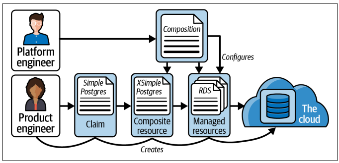

# CROSSPLANE - Cloud Control Plane and more

- Is a distributed systems, with:
  - Control Plane
  - Data Planes
    
 


- It protects `data plane` using distributed systems best practices:
  - Rate limiting
  - Retries
  - Optimistic concurrency
  
- All Crossplane controllers emit `Prometheus metrics` and k8s events.

---

## Provider

- [ref](https://docs.crossplane.io/latest/concepts/providers/)
- Extends Control plane by adding new API endpoints that represent a related set of cloud primitives.
- These managed APIs are called `ManagedResources(MR)`
- A provider installs controllers that reconcile the desired state of its MRs with the data plane.
- Examples:
  - `provider-aws`, `provider-azure`, `provider-gcp`, `provider-kubernetes`, `provider-terraform`, `provider-sql`
    
## Composition

Most control plane consumers(e.g. Platform Engineers) won’t interact with MRs directly.
Instead, they interact with higher-level API abstractions. When a
consumer(e.g. Application Developer) calls these higher-level APIs, Crossplane reconciles their
desired state into one or more MRs. 
Crossplane calls this composition: the higher-level APIs are composed of one or more MRs.

- In k8s analogy, think `Pod` as `MR` and `Deployment` as `Composition`

## Composite Resource Claims or Claims

Are higher level API abstractions that consumers call to specify the desired state of their data plane.

- A claim is composed of one or more MRs, which is the source of terms like `composite resource` and `composition`.

- Provider authors set MR types and schemes
- ControlPlane curators set claim types and schemas and could be of any shape curators need.

## Composite Resource Definition (XRD)

- `XRD`, lets you define a new kind of claim (special kind of API that adds new APIs to Crossplane)
- Claim:
  - A single `claim` could have group of `MR`s representing several cloud primitives into a single API.
  - For example, a SimplePostgres claim cloud be composed of an RDS-instance MR, a firewall-rule MR, and an IAM role-binding MR.
- XRD also have `kind`(type of your new claim) and `spec`(schema of this new claim)
- When you create an XRD, Crossplane adds a new API endpoint for your kind of claim.
- It also starts a controller that reconciles claims, called a claim controller.
- Claim controller doesn't create MRs directly.
- Between a claim and its MRs lies an intermediate API resource called a composite resource, or `XR`.
- When claim is created, Crossplane automatically creates a matching XR.
- The XR controller then creates MRs.


*A composite resource definition defines the type and
schema of a claim and a composite resource.*

- Most XRDs define both an XR and a claim.
- All claims have a corresponding XR type, but not all XRs have a corresponding claim type.
- `You can create an XRD that defines only an XR, not a caim`.
  - Allows you to define private API abstraction: once that control plane consumers can't use directly.
- XR can be composed of other XRs.
- Example,  the security team defines a standard FirewallRule XR.
The database team should be allowed to compose a FirewallRule XR
into a higher-level SimplePostgres claim, but the average platform
consumer should not be able to create a FirewallRule claim directly
  


*A composite resource may be composed of other composite
resources.*

## Composition

An XRD teaches Crossplane about a new consumer-facing API; a Composition teaches
Crossplane what to do when that API is called.

In its simplest form,
a Composition is a list of the MRs Crossplane should create, update,
or delete when a control plane consumer creates, updates, or deletes
a claim.



*A composition configures how Crossplane composes man‐
aged resources from a given claim*

```html
In programming terms, an XRD defines an interface, and a Compo‐
sition satisfies that interface. Different Compositions can satisfy the
interface defined by an XRD. You could create a Composition that
satisfies a SimplePostgres claim using an AWS RDS instance and
another that could satisfy the same claim using a Google CloudSQL
instance. When a control plane consumer makes a claim, they can
influence which Composition Crossplane will use. Control plane
curators can add arbitrary sets of labels to a Composition, such as
provider: aws, or region: us-west-1. The consumer can specify a
set of labels as part of their claim’s desired state, telling Crossplane to
use only a Composition that has those same labels. This behavior is
optional; a curator can instead force a particular claim API to always
use a specific Composition.
```

Crossplane supports two styles of Composition: patch and transform
Composition (P&T) and Composition Functions.

### P&T Composition
When using P&T Composition, you specify a base list of man‐
aged resource templates. Each of these base resources can be
patched with values copied from the claim. A value can option‐
ally be transformed before it’s applied to the base, for example to
convert megabytes to gigabytes or a string to an integer.

### Composition Functions
When using Composition Functions, you specify a pipeline of
Open Container Initiative (OCI) containers. The claim’s XR is
passed to these containers, which are responsible for returning
managed resources for Crossplane to create, update, or delete.

---

## Packaging ControlPlane configurations

There are two kinds of Crossplane packages:

### Provider package
A Provider package installs a Provider. It creates API endpoints
for all of a Provider’s MRs, and it installs controllers to reconcile
those MRs with the data plane. Most curators won’t create Provider packages but will install them.


### Configuration package
A Configuration package configures your control plane with
new capabilities. Typically a Configuration package will configure your control plane to serve one or more new kinds of
claim API. It does this by installing a collection of Providers,
XRDs, and Compositions. Most curators do curate their own
Configuration packages.

A Crossplane package is an OCI image with special Crossplane specific metadata. 
This means Crossplane packages can be distributed by any kind of OCI registry, 
including Amazon’s Elastic Container Registry (ECR), Google Container Registry (GCR), and
Upbound’s Marketplace, which is focused specifically on Crossplane
packages.


[Crossplane Adopters](https://github.com/crossplane/crossplane/blob/master/ADOPTERS.md)